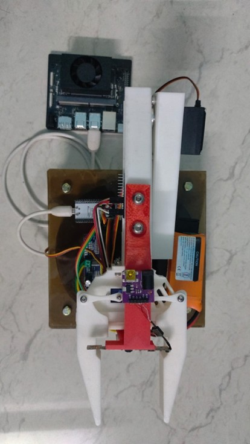
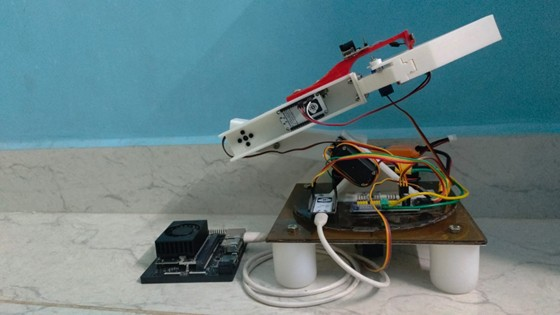
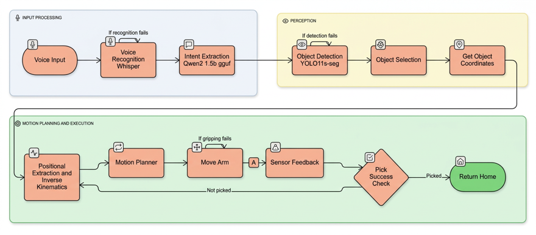
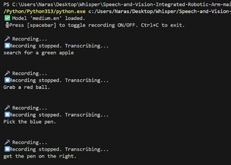
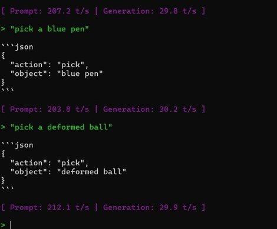
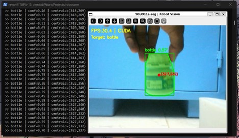

# Speech and Vision Integrated Robotic Arm for Smart Picking

> A multimodal human-robot interaction system that lets anyone pick up objects using natural voice commands — no programming required. Runs entirely on-device with no cloud dependency.

---

## Overview

Traditional robotic arms require expert programming or manual controllers, creating a barrier for everyday use. This project bridges that gap by integrating **natural language understanding**, **real-time computer vision**, and **low-level embedded control** into a single cohesive pipeline.

A user speaks a natural command — *"grab the blue pen"* — and the system transcribes the speech, extracts intent, locates the object in the scene using instance segmentation, computes the arm trajectory, and executes a smooth pick motion. Everything runs natively on an **NVIDIA Jetson Orin Nano** without any internet or cloud dependency.

This project was developed as a final year B.Tech project at Vellore Institute of Technology, Chennai (April 2026).

---

## Demo

| Top View | Side View |
|----------|-----------|
|  |  |

---

## Features

- **Zero-shot natural language control** — understands full descriptive phrases like *"pick the deformed ball"*, not just keywords
- **Fully on-device AI** — whisper.cpp + Qwen2 1.5B GGUF + YOLO11s-seg, all running on Jetson GPU with no cloud calls
- **Instance segmentation** — YOLO11s-seg produces pixel-accurate masks for precise centroid extraction, outperforming bounding-box detectors for coordinate calculation
- **3D object localisation** — VL53L1X Time-of-Flight sensor provides depth, combined with 2D centroid for real-world coordinate computation
- **Custom IK/FK solver** — analytic inverse and forward kinematics with joint limit enforcement and z-constraint filtering
- **Jerk-free motion** — non-blocking servo update loop incrementing PWM in steps of 10 every 30ms for smooth, safe movement
- **Modular architecture** — perception, planning, and embedded control are fully decoupled; upgrading one layer doesn't affect the others
- **90%+ NLU accuracy** — Qwen2 1.5B GGUF intent extraction validated across 100 test samples

---

## System Architecture



```
┌─────────────────────────────────────────────────────────────────────────┐
│                        NVIDIA Jetson Orin Nano                          │
│                                                                         │
│  ┌──────────────────┐    ┌──────────────────┐    ┌──────────────────┐  │
│  │  LAYER 1         │    │  LAYER 1         │    │  LAYER 2         │  │
│  │  Audio / NLU     │    │  Vision          │    │  Planning        │  │
│  │                  │    │                  │    │                  │  │
│  │  arecord (WAV)   │    │  USB Webcam      │    │  OpenCV + TOF    │  │
│  │       ↓          │    │       ↓          │    │  (3D coords)     │  │
│  │  whisper.cpp     │    │  YOLO11s-seg     │    │       ↓          │  │
│  │  (STT on GPU)    │    │  (segmentation)  │    │  IK/FK Solver    │  │
│  │       ↓          │    │       ↓          │    │  (joint angles)  │  │
│  │  Qwen2 1.5B GGUF │───▶│  Object match    │    │       ↓          │  │
│  │  (intent JSON)   │    │  + centroid      │───▶│  Serial command  │  │
│  └──────────────────┘    └──────────────────┘    └────────┬─────────┘  │
└──────────────────────────────────────────────────────────┬─────────────┘
                                                           │ USB Serial
                                                           │ 115200 baud
                                              ┌────────────▼─────────────┐
                                              │       Arduino/ESP32       │
                                              │                           │
                                              │  PCA9685 PWM driver       │
                                              │  4× Servo motors          │
                                              │  VL53L1X TOF sensor       │
                                              └──────────────────────────┘
```

### Full Pipeline

```
Voice Input
    → arecord (WAV, CD quality, plughw:2,0)
    → whisper.cpp [ggml-base.en-q5_0, GPU]
    → Qwen2 1.5B GGUF → {"action": "GRAB", "object": "blue pen"}
    → YOLO11s-seg (instance segmentation, label match)
    → OpenCV centroid + VL53L1X depth → 3D world coordinates
    → IK/FK Solver → joint angles [base, shoulder, elbow]
    → Serial: "d <base> <shoulder> <elbow>" + "g <angle>"
    → Arduino → PCA9685 PWM → Servo execution
```

---

## Hardware

### Components

| Component | Model | Role |
|-----------|-------|------|
| AI Computer | NVIDIA Jetson Orin Nano | All AI inference — STT, NLU, vision |
| Microcontroller | Arduino (ESP32) | Low-level servo and sensor control |
| Servo Driver | Adafruit PCA9685 | 16-channel PWM at 50Hz, I2C 0x40 |
| Arm Servos | SG90 + MG995 | Base, shoulder, elbow, gripper joints |
| Depth Sensor | Adafruit VL53L1X TOF | Gripper-mounted, demand-driven depth |
| Camera | USB Webcam | Visual feed for YOLO pipeline |
| Microphone | USB Microphone | Audio capture via arecord |
| Frame | 3D-printed + polycarbonate | Custom arm body and base platform |
| Power | LiPo battery pack | Independent servo power supply |

### Arm Specification

| Joint | Servo | PWM Range |
|-------|-------|-----------|
| Base | MG995 | 110 – 590 |
| Shoulder | MG995 | 110 – 590 |
| Elbow | SG90 | 110 – 590 |
| Gripper | SG90 | 125 – 400 |

Smooth motion is achieved by incrementing current PWM toward target in steps of 10 every 30ms (non-blocking).

### IK/FK Constants

| Parameter | Value |
|-----------|-------|
| Base height (D1) | 50.0 mm |
| Shoulder link (L2) | 110.0 mm |
| Elbow link (L3) | 260.0 mm |
| Z forbidden zone | z < −50 mm |

---

## Software Stack

| Layer | Tool | Language | Purpose |
|-------|------|----------|---------|
| Audio capture | arecord | — | WAV recording from USB mic at `plughw:2,0` |
| Speech-to-text | whisper.cpp (`ggml-base.en-q5_0`) | C++ | On-device GPU transcription |
| Intent extraction | Qwen2 1.5B GGUF | C++ (llama.cpp) | Zero-shot JSON intent parsing |
| Object detection | YOLO11s-seg | Python | Real-time instance segmentation |
| Coordinate compute | OpenCV + VL53L1X | Python | 2D → 3D world coordinate transform |
| Motion planning | Custom IK/FK solver | Python | Analytic IK with joint limits and z-constraint |
| Hardware control | Arduino firmware | C++ (Arduino) | PWM generation via PCA9685 |

### Why these models?

**whisper.cpp** was chosen after evaluating Vosk and Google Cloud STT — it delivered the highest transcription accuracy and noise tolerance while running fully on-device on the Jetson GPU.

**Qwen2 1.5B GGUF** was selected for its ability to parse full natural language descriptions (not just keywords) into structured JSON, running efficiently on edge hardware at ~30 tokens/second.

**YOLO11s-seg** was chosen over standard bounding-box detectors because instance segmentation masks produce more accurate centroids for downstream 3D coordinate calculation — critical for precise arm targeting.

---

## Results

### NLU Pipeline

| Metric | Result |
|--------|--------|
| Overall intent accuracy | 99% (100-sample test) |
| Action classification F1 | 1.00 |
| Object classification F1 | 1.00 |
| Inference speed | ~30 tokens/sec on Jetson |

Qwen2 1.5B GGUF successfully extracts structured intent from full descriptive phrases — *"pick the deformed ball"*, *"get the pen on the right"* — returning clean JSON for every input.

| Speech-to-Text | Intent Extraction |
|---------------|------------------|
|  |  |

### Vision Pipeline

YOLO11s-seg achieved stable high-frame-rate inference on the Jetson Orin Nano's GPU across multi-object scenes. The model successfully isolated target objects from cluttered workspaces by matching detected instance labels to the intent JSON output.



---

## Repository Structure

```
speech-vision-robotic-arm/
├── jetson/
│   ├── audio/
│   │   ├── master.cpp              # Main control loop — keypress handler
│   │   ├── rec_till_r.cpp          # Audio recording (arecord, WAV)
│   │   ├── play_rec.cpp            # Playback utility
│   │   ├── whisper_call.cpp        # whisper.cpp STT wrapper
│   │   └── whisper_call_log.cpp    # STT with timestamped transcript logging
│   ├── nlu/
│   │   ├── whisp_embed_nu.cpp      # Qwen2 + whisper embedded pipeline
│   │   └── intent_client.cpp       # Intent extraction via local LLM server
│   └── vision/
│       └── yolo_detection.py       # YOLO11s-seg object detection + tracking
│
├── planning/
│   ├── fk_ik_mat.py                # Custom FK/IK solver with joint limits
│   └── test_angle_control.py       # Angle → serial command test utility
│
├── arduino/
│   ├── servo_control.ino           # PCA9685 servo driver + serial command parser
│   └── tof_sensor.ino              # VL53L1X TOF sensor (demand-driven)
│
├── images/
│   ├── arm_top_view.jpg
│   ├── arm_side_view.jpg
│   ├── architecture.png
│   ├── intent_extraction.jpg
│   ├── object_detection.jpg
│   └── speech-to-text.jpg
│
├── report.pdf                      # Full B.Tech project report (VIT Chennai, 2026)
└── README.md
```

> **Note:** Source code is currently being consolidated from multiple development machines and will be uploaded shortly. Full implementation details, including all module code, are documented in [`report.pdf`](report.pdf).

---

## Key Design Decisions

**Why decouple the Jetson from the Arduino?**
Separating AI inference (Jetson) from hardware control (Arduino) means upgrading the vision model or STT engine requires no changes to the servo firmware. The interface is a simple text protocol over USB Serial — clean and stable.

**Why instance segmentation instead of bounding boxes?**
Bounding box centroids are approximate — they include background pixels and fail on irregular or occluded objects. Segmentation masks give pixel-accurate centroids, which translates directly to more precise 3D coordinate computation and fewer missed picks.

**Why analytic IK instead of learned IK?**
An analytic solver is deterministic, fast (no GPU needed), and interpretable. It checks joint limits and z-constraints before returning solutions, so invalid poses are rejected before a single servo moves. Learned IK would require retraining for each arm configuration.

**Why Qwen2 1.5B over a keyword parser?**
Keyword parsers fail on synonyms, descriptions, and spatial qualifiers (*"the pen on the right"*, *"the deformed ball"*). Qwen2 1.5B handles these zero-shot, returning structured JSON that maps cleanly to the vision pipeline without any rule engineering.

---

## Serial Command Protocol

Commands sent from Jetson to Arduino over USB at 115200 baud:

| Command | Format | Example | Response |
|---------|--------|---------|----------|
| Move arm | `d <base> <shoulder> <elbow>` | `d 90 45 30` | `ok` |
| Move gripper | `g <angle>` | `g 60` | `ok` |
| Query PWM state | `?` | `?` | `pwm b s e g` |
| TOF depth request | `s` (sent to TOF Arduino) | `s` | distance in mm |

---

## Tech Stack

`C++` · `Python` · `Arduino` · `NVIDIA Jetson Orin Nano` · `whisper.cpp` · `Qwen2 1.5B GGUF` · `YOLO11s-seg` · `OpenCV` · `PCA9685` · `VL53L1X TOF` · `FreeRTOS` · `ESP32`

---

## Team

**Revan MJ** (22BLC1345) — [LinkedIn](https://linkedin.com/in/revanmj) · [GitHub](https://github.com/RevanMJ10)

**Velmurugan S** (22BLC1403)

**Sham Ganesh M** (22BLC1341)

B.Tech Electronics and Computer Engineering — VIT Chennai, April 2026

Supervised by **Dr. Idayachandran**, School of Electronics Engineering, VIT Chennai.
